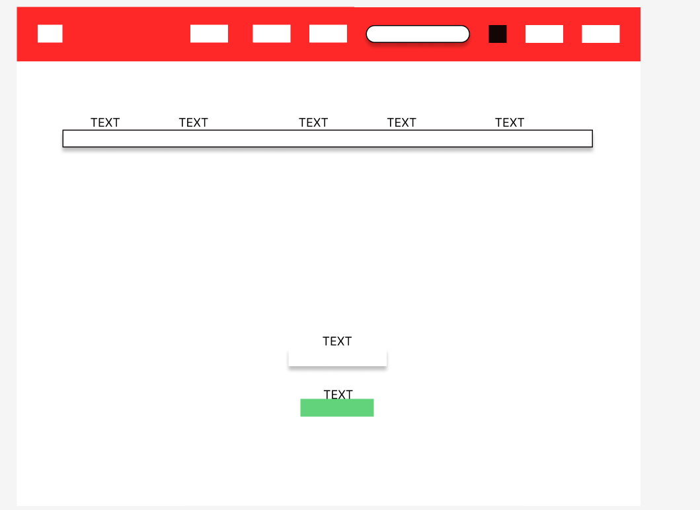
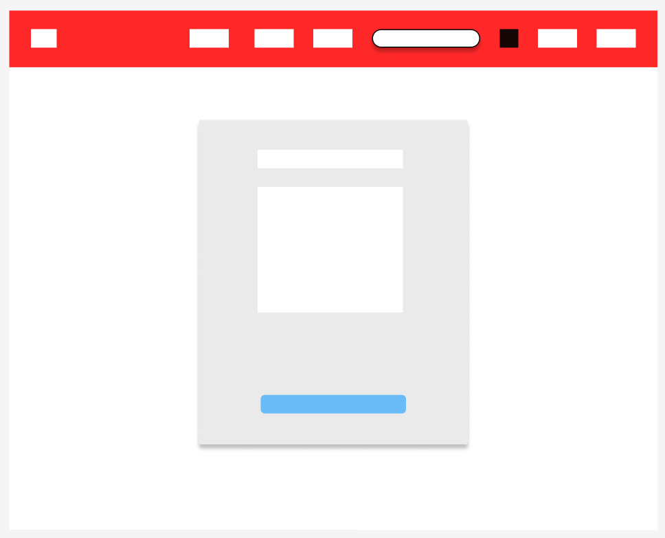
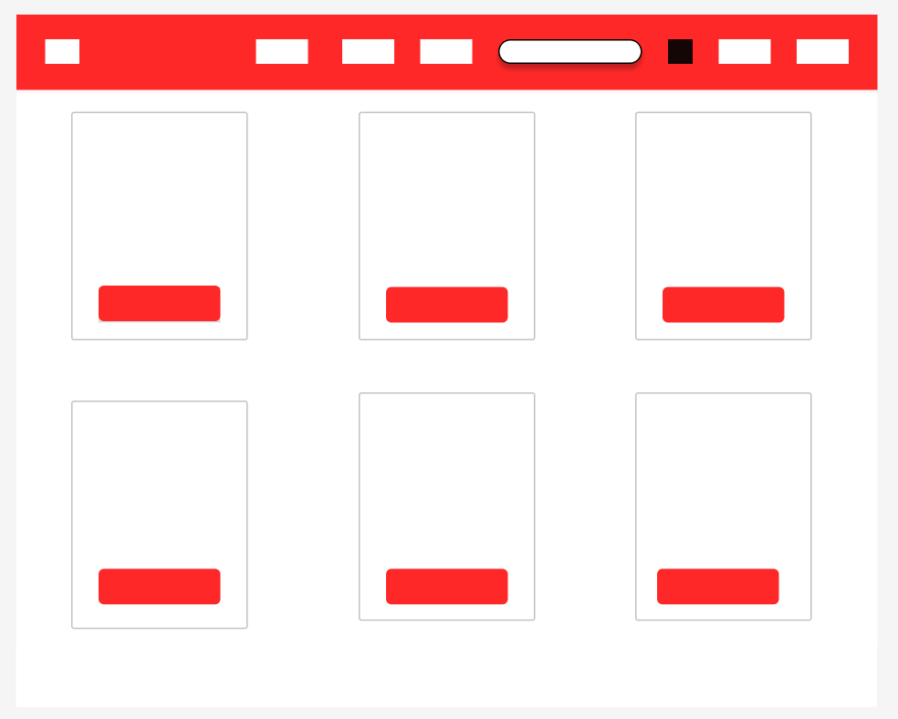
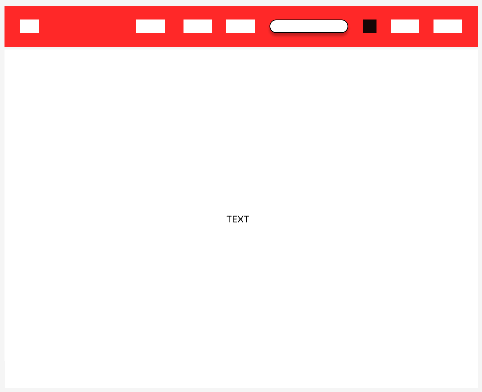
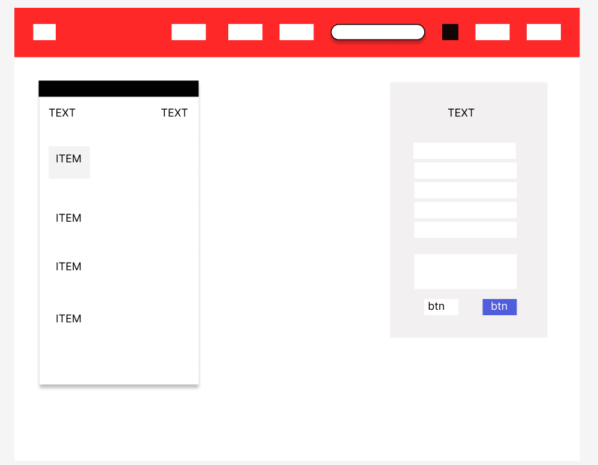

# ElectgroniXpress

## Application's Purpose and Value
### Overview

ElectgroniXpress is a dynamic e-commerce platform tailored to provide a seamless experience for users passionate about buying and selling electronic items. Whether you're a tech enthusiast seeking to upgrade your gadgets or looking to declutter by selling unused electronics, ElectgroniXpress caters to both buyers and sellers.

### Purpose
The primary objective of ElectgroniXpress is to establish a vibrant marketplace for electronics enthusiasts. It aims to be the go-to platform for electronic transactions, offering a user-friendly interface, seamless navigation, and efficient features for both buying and selling.

### Business Model Documentation 
#### Revenue Generation
ElectgroniXpress generates revenue through transaction fees on successful sales made through the platform. A small percentage of each successful transaction contributes to the platform's sustainability.

#### Target Audience
Our target audience includes tech enthusiasts, gadget lovers, and individuals looking for a reliable platform to buy and sell electronics. We aim to create a community where users can connect over their shared passion for technology.

#### Unique Selling Propositions 
1. Seamless User Experience: ElectgroniXpress prioritizes a user-friendly interface for both buyers and sellers.
2. Wide Product Range: Our platform offers a diverse range of electronic items, encouraging users to explore and find their desired tech products.
3. Community Engagement: We foster a vibrant community of electronics enthusiasts through forums and discussions.

## UX Design 
### Design Process
Our UX design process involves:
1. **Research:** Understanding user needs and preferences in the electronics marketplace.
2. **Wireframing:** Creating wireframes to outline the structure and layout of key pages.
3. **Mockups and Prototypes:** Designing visual mockups and interactive prototypes for user testing.
4. **User Feedback:** Iterating based on user feedback to optimize the user experience.

### Design Elements
#### Color Palette
We chose a modern color palette with a blend of tech-inspired Orange and whites, creating a visually appealing and cohesive design.

#### Typography
The use of a clean and readable 'AR One Sans' font ensures that users can easily consume information without distractions.

## SEO and Metadata 
### Optimization Strategies
1. **SEO Mechanisms:** Implemented through `robots.txt` and `sitemap.xml` following industry best practices.
2. **Customized Meta Tags:** Providing additional information about the website, enhancing its relevance in search results.
3. **Site Title:** Thoughtfully chosen to encapsulate the essence of ElectgroniXpress.
4. **Rel Attributes:** Diligently incorporated to improve the website's search engine performance.
5. **Sitemap and Robots.txt:** `sitemap.xml` file aids search engine crawlers, while `robots.txt` guides web crawlers on crawling and indexing.

### Conclusion

ElectgroniXpress is committed to providing not just a seamless user experience but also ensuring that our platform is easily discoverable by those seeking electronic items. Our ongoing efforts in SEO optimization reflect our dedication to reaching a broader audience.

Explore ElectgroniXpress today and discover the power of a platform designed with both users and search engines in mind!

## Marketing Strategy

### Overview
Welcome to ElectgroniXpress, your ultimate destination for seamless buying and selling of electronics online. Our mission is to provide a hassle-free experience for tech enthusiasts to connect and trade electronic items effortlessly.

### Key Strategies

1. **User-Friendly Experience:**
   - Emphasize our intuitive platform for easy listing, buying, and selling.
   - Highlight a straightforward process for electronics enthusiasts.

2. **Wide Product Range:**
   - Showcase the diverse range of electronic items available on ElectgroniXpress.
   - Encourage users to explore and find their desired tech products.
3. **Community Engagement:**
   - Foster a vibrant community of electronics enthusiasts through forums and discussions.
   - Encourage users to share their experiences, reviews, and recommendations.

4. **Exclusive Promotions:**
   - Introduce special promotions and discounts to attract both buyers and sellers.
   - Create a sense of exclusivity for users engaging with ElectgroniXpress.

### Connect, Trade, and Explore the World of Electronics with ElectgroniXpress!

At ElectgroniXpress, we believe in fostering a community where technology enthusiasts can connect, trade, and explore the world of electronics. Our marketing strategies are designed to create a space where both buyers and sellers feel valued, ensuring a dynamic and rewarding experience for all.

Join ElectgroniXpress today and be part of a thriving community passionate about technology!

## Features

-   User registration and authentication
-   Listing electronic items for sale
-   Buying electronic items
-   Stylish frontend using Bootstrap 4 and Django-Crispy-Forms
-   Cloud storage for images using Amazon S3 and Django-Storages
-   PostgreSQL database for data storage

## Technology

-   Django 4.2.7
-   Django-Allauth 0.58.2
-   Django-Crispy-Forms 2.1
-   Gunicorn 21.2.0
-   PostgreSQL
-   HTML, CSS, JavaScript
-   Amazon S3 (for static files and media storage)

## Requirements

The application requires the following packages and libraries to be installed:

* dj-database-url==2.1.0
* Django==4.2.7
* django-allauth==0.58.2
* django-countries==7.5.1
* django-crispy-forms==2.1
* gunicorn==21.2.0
* psycopg2-binary==2.9.9
* whitenoise==6.6.0
* zipp==1.0.0
* boto3==1.28.84 
* django-storages==1.14.2 
* crispy-bootstrap4==2022.1`

## Getting Started

To set up and run ElectgroniXpress, follow these steps:

1.  Ensure you have Python and pip installed.
    
2.  Create a virtual environment and activate it.
    
3.  Install the required dependencies using the following command:
    
    pip install freeze > requirements.txt
    
4.  Create a `.env` file in the project directory and define the following environment variables:
     * SECRET_KEY=your-secret-key
    *  DATABASE_URL=your-database-url
    
6.  Run the application using the following command:
    
    `python manage.py runserver` 
    
7.  Access the application in your web browser at [http://127.0.0.1:8000/](http://127.0.0.1:8000/).
    

## Database

The application uses a PostgreSQL database, configured using the `dj-database-url` package. The database URL is fetched from the `DATABASE_URL` environment variable.

## Static Files and Media

Static files (CSS, JavaScript, etc.) and media files are managed using Amazon S3 for storage. The configuration includes settings for `MEDIA_URL`, `DEFAULT_FILE_STORAGE`, `STATIC_URL`, and `STATICFILES_STORAGE`.

## Security Measures
ElectgroniXpress prioritizes the security of user data. Measures include:
- CSRF protection.
- Password validation.
- Secure transmission through HTTPS.
- Encryption of sensitive data.

## Manual Testing 
### Project Overview

-   **Project Name:** ElectgroniXpress
-   **Testing Scope:** Functionality, Usability, and Responsiveness
-   **Testing Goals:** Ensure that the website functions as expected, is user-friendly, and responsive on different devices and screen sizes.

### Test Plan 
#### User Registration

1.  **Navigate to the registration page.**
2.  **Fill in valid registration details.**
3.  **Click the "Register" button.**
4.  **Verify that the user is redirected to the profile page.**
    -   _Expected Outcome:_ User registration is successful.

#### Item Management

1.  **Log in as an admin.**
2.  **Navigate to the "Sell Item" page.**
3.  **Fill in the Item details.**
4.  **Click the "Add Item" button.**
5.  **Verify that the new Item appears on the Listings page.**
    -   _Expected Outcome:_ Item listed successfully.

#### Usability Testing

1.  **Navigate through the website as a new user.**
2.  **Assess the intuitiveness of the navigation menu.**
3.  **Evaluate the readability and layout of content.**
    -   _Expected Outcome:_ The website is user-friendly and intuitive.

#### Responsiveness Testing

1.  **Access the website on various mobile devices.**
2.  **Check for layout issues and readability.**
    -   _Expected Outcome:_ The website is responsive and displays correctly on mobile devices.

### Test Results

#### Manual Testing:

-   **User Registration:** Passed
-   **Item Management:** Passed
-   **Usability Testing:** Passed
-   **Responsiveness Testing:** Passed

## Bugs Fixed

- 'User' object has no attribute 'profile'
    * SOLUTION: Modifying the signal to create and save profile   

- Forbidden CSRF verification failed
   * SOLUTION: Added URL to CSRF_TRUSTED_ORIGINS =[]

- Server Error 500 
    * SOLUTION: Change whitenoise to STATICFILES_STORAGE = 'whitenoise.storage.CompressedStaticFilesStorage'

    and use HITENOISE_USE_FINDERS = True to apply CSS 

## Code Validator Results

- The code is validated and does not show any errors on:
    - [HTML validation](https://validator.w3.org/nu/#textarea)
    - [CSS validation](https://jigsaw.w3.org/css-validator/#validate_by_input)
    - [Python/Django](https://pep8ci.herokuapp.com/)

## Credits & Acknowledgments

-   Code Institute: Thanks to the Code Institute for providing project classes instrumental in developing ElectgroniXpress.
-   Django: The web framework used to build this application.
-   Amazon S3: The cloud-based platform used for managing static files and media.
-   dj-database-url: A package for configuring the database using environment variables.
-   Bootstrap: The front-end framework for styling the application.
-   Python: The programming language used to write the application's logic.
-   GitHub: The platform used for version control and collaboration.
 
## Deployment

### Prepare Your Project

1.  Ensure your project has the necessary files: requirements.txt to list required Python packages and a "Procfile" to specify how Heroku should run your app.

 
### Deploy to Heroku

1.  If you don't have a Heroku account, sign up at Heroku.
2.  Use the Heroku CLI to log in:
3.  Create a new Heroku app with a name of your choice:
4.  Connect your Heroku app to your GitHub repository from the Heroku dashboard.
5.  Enable automatic deployment from your desired branch.
6.  Set environment variables like `SECRET_KEY`, `DEBUG`, and others in the Heroku app settings.
7.  Trigger a manual deployment from the Heroku dashboard or let Heroku automatically deploy when changes are pushed to the connected GitHub repository.
    

### Deployed Link

[ElectgroniXpress on Heroku](https://onlineshopfirst-9d7d819c65b1.herokuapp.com/home.html)
