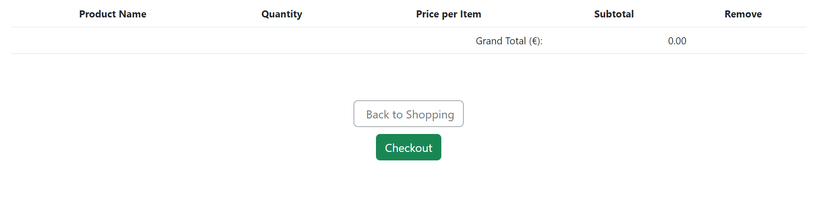

# [ELECTRONIXPRESS](https://onlineshopfirst-9d7d819c65b1.herokuapp.com)

[](https://github.com/DavidcD8/ElectroniXpress/commits/main)
[](https://github.com/DavidcD8/ElectroniXpress/commits/main)
[](https://github.com/DavidcD8/ElectroniXpress)

# ElectgroniXpress

## Application's Purpose and Value
### Overview

ElectgroniXpress is a dynamic e-commerce platform tailored to provide a seamless experience for users passionate about buying and selling electronic items. Whether you're a tech enthusiast seeking to upgrade your gadgets or looking to declutter by selling unused electronics, ElectgroniXpress caters to both buyers and sellers.


### Purpose
The primary objective of ElectgroniXpress is to establish a vibrant marketplace for electronics enthusiasts. It aims to be the go-to platform for electronic transactions, offering a user-friendly interface, seamless navigation, and efficient features for both buying and selling.


### Business Model Documentation 
#### Revenue Generation
ElectgroniXpress generates revenue through transaction fees on successful sales made through the platform. A small percentage of each successful transaction contributes to the platform's sustainability.


#### Target Audience
Our target audience includes tech enthusiasts, gadget lovers, and individuals looking for a reliable platform to buy and sell electronics. We aim to create a community where users can connect over their shared passion for technology.


#### Unique Selling Propositions 
1. Seamless User Experience: ElectgroniXpress prioritizes a user-friendly interface for both buyers and sellers.
2. Wide Product Range: Our platform offers a diverse range of electronic items, encouraging users to explore and find their desired tech products.
3. Community Engagement: We foster a vibrant community of electronics enthusiasts through forums and discussions.


### Competitive Edge and Market Strategy

ElectgroniXpress aims to differentiate itself in the market through:

1. **Seamless User Experience:** Prioritizing a user-friendly interface for both buyers and sellers.
2. **Wide Product Range:** Offering a diverse selection of electronic items to cater to various preferences.
3. **Community Engagement:** Fostering a vibrant community through forums and discussions.
4. **Search Engine Optimization (SEO):** Implementing robust SEO strategies to enhance discoverability.


### Growth and Expansion

As part of our long-term strategy, ElectgroniXpress plans to:

1. **Explore Partnerships:** Collaborate with electronic manufacturers and retailers to expand the product catalog.
2. **International Expansion:** Target global audiences to create a more extensive and diverse user base.
3. **Introduce Premium Services:** Explore options for premium memberships or enhanced features for additional revenue streams.

Our business model is designed to evolve with the dynamic landscape of the e-commerce industry, ensuring sustainability, user satisfaction, and continuous growth.


---


## UX
### Design Process
Our UX design process involves:
1. **Research:** Understanding user needs and preferences in the electronics marketplace.
2. **Wireframing:** Creating wireframes to outline the structure and layout of key pages.
3. **Mockups and Prototypes:** Designing visual mockups and interactive prototypes for user testing.
4. **User Feedback:** Iterating based on user feedback to optimize the user experience.


### Design Elements
---
### Colour Scheme
I chose a modern color palette with a blend of tech-inspired Orange and whites, creating a visually appealing and cohesive design.

- `#000000` used for primary text.
- `#E84610` used for primary highlights.
- `#4A4A4F` used for secondary text.
- `#009FE3` used for secondary highlights.

I used [coolors.co](https://coolors.co/e84610-009fe3-4a4a4f-445261-d63649-e6ecf0-000000) to generate my colour palette.


### Typography
The use of a clean and readable 'AR One Sans' font ensures that users can easily consume information without distractions.

- [AR+One+Sans](https://fonts.google.com/specimen/AR+One+Sans) was used for the primary headers and titles.

- [Font Awesome](https://fontawesome.com) icons were used throughout the site, such as the social media icons in the footer.

## User Stories


### New Site Users

- As a Site user, I would like to go to the checkout page, so that I can enter my details and pay.
- As a Site user, I would like to add items to the bag, so that I can keep track of the items I am interested, in before checking out.
- As a Site user, I would like to have profile, so that I can see, my past interaction on the site.
- As a Site user, I woul like to view all Items available, so that I can choose one to buy.
- As a Site user,  I would like to signup for a new account, so that I can view all listings.
- As a Site user, I would like to login, so that I can Buy and Sell Items.


### Site Admin

- As a site administrator, I should be able to access all information, so that I can manage the website.

## Wireframe

### Tables

| First Header  | Second Header   |
| :------------ |:---------------:|
| |  |
||         |
|  |
 
 
## Features
-   User registration and authentication
-   Listing electronic items for sale
-   Buying electronic items
-   Stylish frontend using Bootstrap 4 and Django-Crispy-Forms
-   Cloud storage for images using Amazon S3 and Django-Storages
-   PostgreSQL database for data storage





### Future Features

- USER TO MESSAGES-#1
    - To allow users to message sellers

## Tools & Technologies Used

-   Django-Allauth 0.58.2
-   Django-Crispy-Forms 2.1
-   Gunicorn 21.2.0


- [](https://tim.2bn.dev/markdown-builder) used to generate README and TESTING templates.
- [](https://git-scm.com) used for version control. (`git add`, `git commit`, `git push`)
- [](https://github.com) used for secure online code storage.
- [](https://codeanywhere.com) used as a cloud-based IDE for development.
- [](https://code.visualstudio.com) used as my local IDE for development.
- [](https://en.wikipedia.org/wiki/HTML) used for the main site content.
- [](https://en.wikipedia.org/wiki/CSS) used for the main site design and layout.

- [](https://www.python.org) used as the back-end programming language.

- [](https://www.heroku.com) used for hosting the deployed back-end site.

- [](https://getbootstrap.com) used as the front-end CSS framework for modern responsiveness and pre-built components.

- [](https://www.djangoproject.com) used as the Python framework for the site.
- [](https://www.elephantsql.com) used as the Postgres database.
- [](https://whitenoise.readthedocs.io) used for serving static files with Heroku.
- [](https://stripe.com) used for online secure payments of ecommerce products/services.

- [](https://aws.amazon.com/s3) used for online static file storage.
- [](https://fontawesome.com) used for the icons.


## Database Design

The application uses a PostgreSQL database, configured using the `dj-database-url` package. The database URL is fetched from the `DATABASE_URL` environment variable.


## Agile Development Process

### GitHub Projects

[GitHub Projects](https://github.com/DavidcD8/ElectroniXpress/projects) served as an Agile tool for this project.


### GitHub Issues

[GitHub Issues](https://github.com/DavidcD8/ElectroniXpress/issues) served as an another Agile tool.
There, I used my own **User Story Template** to manage user stories.

It also helped with milestone iterations on a weekly basis.

- [Open Issues](https://github.com/DavidcD8/ElectroniXpress/issues) [](https://github.com/DavidcD8/ElectroniXpress/issues)

   

- [Closed Issues](https://github.com/DavidcD8/ElectroniXpress/issues?q=is%3Aissue+is%3Aclosed) [](https://github.com/DavidcD8/ElectroniXpress/issues?q=is%3Aissue+is%3Aclosed)

    


## Ecommerce Business Model

This site sells goods to individual customers, and therefore follows a `Business to Customer` model.
It is of the simplest **B2C** forms, as it focuses on individual transactions, and doesn't need anything
such as monthly/annual subscriptions.

It is still in its early development stages, although it already has a newsletter, and links for social media marketing.

Social media can potentially build a community of users around the business, and boost site visitor numbers,
especially when using larger platforms such a Facebook.

A newsletter list can be used by the business to send regular messages to site users.
For example, what items are on special offer, new items in stock,
updates to business hours, notifications of events, and much more!

## Search Engine Optimization (SEO) & Social Media Marketing

### Keywords

I've identified some appropriate keywords to align with my site, that should help users
when searching online to find my page easily from a search engine.


### Sitemap

I've used [XML-Sitemaps](https://www.xml-sitemaps.com) to generate a sitemap.xml file.
This was generated using my deployed site URL: https://onlineshopfirst-9d7d819c65b1.herokuapp.com

After it finished crawling the entire site, it created a
[sitemap.xml](sitemap.xml) which I've downloaded and included in the repository.

### Robots

I've created the [robots.txt](robots.txt) file at the root-level.
Inside, I've included the default settings:

```
User-agent: *
Disallow:
Sitemap: https://onlineshopfirst-9d7d819c65b1.herokuapp.com/sitemap.xml
```

Further links for future implementation:
- [Google search console](https://search.google.com/search-console)
- [Creating and submitting a sitemap](https://developers.google.com/search/docs/advanced/sitemaps/build-sitemap)
- [Managing your sitemaps and using sitemaps reports](https://support.google.com/webmasters/answer/7451001)
- [Testing the robots.txt file](https://support.google.com/webmasters/answer/6062598)

### Social Media Marketing

Creating a strong social base (with participation) and linking that to the business site can help drive sales.
Using more popular providers with a wider user base, such as Facebook, typically maximizes site views.


### Connect with us on Facebook
Stay updated and join our community on [Facebook](https://www.facebook.com/profile.php?id=61555939437707). Follow ElectgroniXpress for the latest news, promotions, and discussions.

### Newsletter Marketing

I have incorporate a newsletter sign-up form on my application, to allow users to supply their
email address if they are interested in learning more. 


## Testing

> [!NOTE]  
> For all testing, please refer to the [TESTING.md](TESTING.md) file.

## Deployment

The live deployed application can be found deployed on [Heroku](https://onlineshopfirst-9d7d819c65b1.herokuapp.com).

### Amazon AWS

This project uses [AWS](https://aws.amazon.com) to store media and static files online, due to the fact that Heroku doesn't persist this type of data.

Once you've created an AWS account and logged-in, follow these series of steps to get your project connected.
Make sure you're on the **AWS Management Console** page.

#### S3 Bucket

- Search for **S3**.
- Create a new bucket, give it a name (matching your Heroku app name), and choose the region closest to you.
- Uncheck **Block all public access**, and acknowledge that the bucket will be public (required for it to work on Heroku).
- From **Object Ownership**, make sure to have **ACLs enabled**, and **Bucket owner preferred** selected.
- From the **Properties** tab, turn on static website hosting, and type `index.html` and `error.html` in their respective fields, then click **Save**.
- From the **Permissions** tab, paste in the following CORS configuration:

	```shell
	[
		{
			"AllowedHeaders": [
				"Authorization"
			],
			"AllowedMethods": [
				"GET"
			],
			"AllowedOrigins": [
				"*"
			],
			"ExposeHeaders": []
		}
	]
	```

- Copy your **ARN** string.
- From the **Bucket Policy** tab, select the **Policy Generator** link, and use the following steps:
	- Policy Type: **S3 Bucket Policy**
	- Effect: **Allow**
	- Principal: `*`
	- Actions: **GetObject**
	- Amazon Resource Name (ARN): **paste-your-ARN-here**
	- Click **Add Statement**
	- Click **Generate Policy**
	- Copy the entire Policy, and paste it into the **Bucket Policy Editor**

		```shell
		{
			"Id": "Policy1234567890",
			"Version": "2012-10-17",
			"Statement": [
				{
					"Sid": "Stmt1234567890",
					"Action": [
						"s3:GetObject"
					],
					"Effect": "Allow",
					"Resource": "arn:aws:s3:::your-bucket-name/*"
					"Principal": "*",
				}
			]
		}
		```

	- Before you click "Save", add `/*` to the end of the Resource key in the Bucket Policy Editor (like above).
	- Click **Save**.
- From the **Access Control List (ACL)** section, click "Edit" and enable **List** for **Everyone (public access)**, and accept the warning box.
	- If the edit button is disabled, you need to change the **Object Ownership** section above to **ACLs enabled** (mentioned above).

#### IAM

Back on the AWS Services Menu, search for and open **IAM** (Identity and Access Management).
Once on the IAM page, follow these steps:

- From **User Groups**, click **Create New Group**.
	- Suggested Name: `group-electronixpress` (group + the project name)
- Tags are optional, but you must click it to get to the **review policy** page.
- From **User Groups**, select your newly created group, and go to the **Permissions** tab.
- Open the **Add Permissions** dropdown, and click **Attach Policies**.
- Select the policy, then click **Add Permissions** at the bottom when finished.
- From the **JSON** tab, select the **Import Managed Policy** link.
	- Search for **S3**, select the `AmazonS3FullAccess` policy, and then **Import**.
	- You'll need your ARN from the S3 Bucket copied again, which is pasted into "Resources" key on the Policy.

		```shell
		{
			"Version": "2012-10-17",
			"Statement": [
				{
					"Effect": "Allow",
					"Action": "s3:*",
					"Resource": [
						"arn:aws:s3:::your-bucket-name",
						"arn:aws:s3:::your-bucket-name/*"
					]
				}
			]
		}
		```
	
	- Click **Review Policy**.
	- Suggested Name: `policy-electronixpress` (policy + the project name)
	- Provide a description:
		- "Access to S3 Bucket for electronixpress static files."
	- Click **Create Policy**.
- From **User Groups**, click your "group-electronixpress".
- Click **Attach Policy**.
- Search for the policy you've just created ("policy-electronixpress") and select it, then **Attach Policy**.
- From **User Groups**, click **Add User**.
	- Suggested Name: `user-electronixpress` (user + the project name)
- For "Select AWS Access Type", select **Programmatic Access**.
- Select the group to add your new user to: `group-electronixpress`
- Tags are optional, but you must click it to get to the **review user** page.
- Click **Create User** once done.
- You should see a button to **Download .csv**, so click it to save a copy on your system.
	- **IMPORTANT**: once you pass this page, you cannot come back to download it again, so do it immediately!
	- This contains the user's **Access key ID** and **Secret access key**.
	- `AWS_ACCESS_KEY_ID` = **Access key ID**
	- `AWS_SECRET_ACCESS_KEY` = **Secret access key**

#### Final AWS Setup

- If Heroku Config Vars has `DISABLE_COLLECTSTATIC` still, this can be removed now, so that AWS will handle the static files.
- Back within **S3**, create a new folder called: `media`.
- Select any existing media images for your project to prepare them for being uploaded into the new folder.
- Under **Manage Public Permissions**, select **Grant public read access to this object(s)**.
- No further settings are required, so click **Upload**.

### Stripe API

This project uses [Stripe](https://stripe.com) to handle the ecommerce payments.

Once you've created a Stripe account and logged-in, follow these series of steps to get your project connected.

- From your Stripe dashboard, click to expand the "Get your test API keys".
- You'll have two keys here:
	- `STRIPE_PUBLIC_KEY` = Publishable Key (starts with **pk**)
	- `STRIPE_SECRET_KEY` = Secret Key (starts with **sk**)

As a backup, in case users prematurely close the purchase-order page during payment, we can include Stripe Webhooks.

- From your Stripe dashboard, click **Developers**, and select **Webhooks**.
- From there, click **Add Endpoint**.
	- `https://onlineshopfirst-9d7d819c65b1.herokuapp.com/checkout/wh/`
- Click **receive all events**.
- Click **Add Endpoint** to complete the process.
- You'll have a new key here:
	- `STRIPE_WH_SECRET` = Signing Secret (Wehbook) Key (starts with **wh**)


### Heroku Deployment

This project uses [Heroku](https://www.heroku.com), a platform as a service (PaaS) that enables developers to build, run, and operate applications entirely in the cloud.

Deployment steps are as follows, after account setup:

- Select **New** in the top-right corner of your Heroku Dashboard, and select **Create new app** from the dropdown menu.
- Your app name must be unique, and then choose a region closest to you (EU or USA), and finally, select **Create App**.
- From the new app **Settings**, click **Reveal Config Vars**, and set your environment variables.

> [!IMPORTANT]  
> This is a sample only; you would replace the values with your own if cloning/forking my repository.

| Key | Value |
| --- | --- |
| `AWS_ACCESS_KEY_ID` | user's own value |
| `AWS_SECRET_ACCESS_KEY` | user's own value |
| `DATABASE_URL` | user's own value |
| `DISABLE_COLLECTSTATIC` | 1 (*this is temporary, and can be removed for the final deployment*) |
| `EMAIL_HOST_PASS` | user's own value |
| `EMAIL_HOST_USER` | user's own value |
| `SECRET_KEY` | user's own value |
| `STRIPE_PUBLIC_KEY` | user's own value |
| `STRIPE_SECRET_KEY` | user's own value |
| `STRIPE_WH_SECRET` | user's own value |
| `USE_AWS` | True |

Heroku needs three additional files in order to deploy properly.

- requirements.txt
- Procfile
- runtime.txt

You can install this project's **requirements** (where applicable) using:

- `pip3 install -r requirements.txt`

If you have your own packages that have been installed, then the requirements file needs updated using:

- `pip3 freeze --local > requirements.txt`

The **Procfile** can be created with the following command:

- `echo web: gunicorn app_name.wsgi > Procfile`
- *replace **app_name** with the name of your primary Django app name; the folder where settings.py is located*

The **runtime.txt** file needs to know which Python version you're using:
1. type: `python3 --version` in the terminal.
2. in the **runtime.txt** file, add your Python version:
	- `python-3.9.18`

For Heroku deployment, follow these steps to connect your own GitHub repository to the newly created app:

Either:

- Select **Automatic Deployment** from the Heroku app.

Or:

- In the Terminal/CLI, connect to Heroku using this command: `heroku login -i`
- Set the remote for Heroku: `heroku git:remote -a app_name` (replace *app_name* with your app name)
- After performing the standard Git `add`, `commit`, and `push` to GitHub, you can now type:
	- `git push heroku main`

The project should now be connected and deployed to Heroku!

### Local Deployment

This project can be cloned or forked in order to make a local copy on your own system.

For either method, you will need to install any applicable packages found within the *requirements.txt* file.

- `pip3 install -r requirements.txt`.

You will need to create a new file called `env.py` at the root-level,
and include the same environment variables listed above from the Heroku deployment steps.

> [!IMPORTANT]  
> This is a sample only; you would replace the values with your own if cloning/forking my repository.

Sample `env.py` file:

```python
import os

os.environ.setdefault("AWS_ACCESS_KEY_ID", "user's own value")
os.environ.setdefault("AWS_SECRET_ACCESS_KEY", "user's own value")
os.environ.setdefault("DATABASE_URL", "user's own value")
os.environ.setdefault("EMAIL_HOST_PASS", "user's own value")
os.environ.setdefault("EMAIL_HOST_USER", "user's own value")
os.environ.setdefault("SECRET_KEY", "user's own value")
os.environ.setdefault("STRIPE_PUBLIC_KEY", "user's own value")
os.environ.setdefault("STRIPE_SECRET_KEY", "user's own value")
os.environ.setdefault("STRIPE_WH_SECRET", "user's own value")

# local environment only (do not include these in production/deployment!)
os.environ.setdefault("DEBUG", "True")
```

Once the project is cloned or forked, in order to run it locally, you'll need to follow these steps:

- Start the Django app: `python3 manage.py runserver`
- Stop the app once it's loaded: `CTRL+C` or `⌘+C` (Mac)
- Make any necessary migrations: `python3 manage.py makemigrations`
- Migrate the data to the database: `python3 manage.py migrate`
- Create a superuser: `python3 manage.py createsuperuser`
- Load fixtures (if applicable): `python3 manage.py loaddata file-name.json` (repeat for each file)
- Everything should be ready now, so run the Django app again: `python3 manage.py runserver`

If you'd like to backup your database models, use the following command for each model you'd like to create a fixture for:

- `python3 manage.py dumpdata your-model > your-model.json`
- *repeat this action for each model you wish to backup*

#### Cloning

You can clone the repository by following these steps:

1. Go to the [GitHub repository](https://github.com/DavidcD8/ElectroniXpress) 
2. Locate the Code button above the list of files and click it 
3. Select if you prefer to clone using HTTPS, SSH, or GitHub CLI and click the copy button to copy the URL to your clipboard
4. Open Git Bash or Terminal
5. Change the current working directory to the one where you want the cloned directory
6. In your IDE Terminal, type the following command to clone my repository:
	- `git clone https://github.com/DavidcD8/ElectroniXpress.git`
7. Press Enter to create your local clone.

Alternatively, if using Gitpod, you can click below to create your own workspace using this repository.

[](https://gitpod.io/#https://github.com/DavidcD8/ElectroniXpress)

Please note that in order to directly open the project in Gitpod, you need to have the browser extension installed.
A tutorial on how to do that can be found [here](https://www.gitpod.io/docs/configure/user-settings/browser-extension).

#### Forking

By forking the GitHub Repository, we make a copy of the original repository on our GitHub account to view and/or make changes without affecting the original owner's repository.
You can fork this repository by using the following steps:

1. Log in to GitHub and locate the [GitHub Repository](https://github.com/DavidcD8/ElectroniXpress)
2. At the top of the Repository (not top of page) just above the "Settings" Button on the menu, locate the "Fork" Button.
3. Once clicked, you should now have a copy of the original repository in your own GitHub account!


## Credits

-   Code Institute: Thanks to  Code Institute for providing project classes instrumental in developing ElectgroniXpress.
-   Django: The web framework used to build this application.
-   Amazon S3: The cloud-based platform used for managing static files and media.
-   dj-database-url: A package for configuring the database using environment variables.
-   Bootstrap: The front-end framework for styling the application.
-   Python: The programming language used to write the application's logic.
-   GitHub: The platform used for version control and collaboration.

### Content


| Source | Location | Notes |
| --- | --- | --- |
| [Markdown Builder](https://stackedit.io/) | README and TESTING | tool to help generate the Markdown files |
| [WhiteNoise](http://whitenoise.evans.io) | entire site | hosting static files on Heroku temporarily |
 [CodeInstitute](https://codeinstitute.net/ie/full-stack-software-development-diploma/?utm_term=code%20institute&utm_campaign=CI%2B-%2BIRL%2B-%2BSearch%2B-%2BBrand&utm_source=adwords&utm_medium=ppc&hsa_acc=8983321581&hsa_cam=14304747355&hsa_grp=128775288209&hsa_ad=635725005315&hsa_src=g&hsa_tgt=kwd-319867646331&hsa_kw=code%20institute&hsa_mt=e&hsa_net=adwords&hsa_ver=3&gad_source=1&gclid=CjwKCAjw_LOwBhBFEiwAmSEQAVm74pEZ08XYVIEoOT7JQkaLpcs7RopKq1Yvx2JEpa5Qsuj3JHnkVxoCkEoQAvD_BwE) | entire site | hosting static files on Heroku temporarily |
  [django-allauth](https://docs.allauth.org/en/latest/) | entire site |For Registration and authentication

### Media


| Source | Location | Type | Notes |
| --- | --- | --- | --- |
| [Pexels](https://www.pexels.com) | entire site | image | favicon on all pages |


### Acknowledgements

- I would like to thank my Code Institute mentor, [Tim Nelson](https://github.com/TravelTimN) and [Derek Mcauley](https://github.com/derekmcauley7) for his support throughout the development of this project.
- I would like to thank the [Code Institute](https://codeinstitute.net) tutor team for their assistance with troubleshooting and debugging some project issues.
