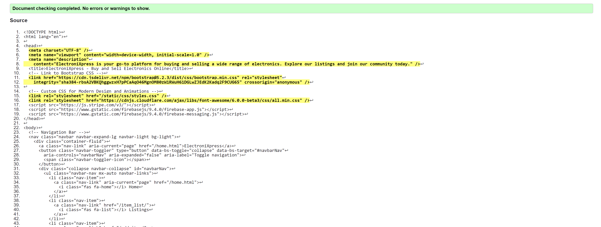

# Testing

> [!NOTE]  
> Return back to the [README.md](README.md) file.

Feature-by-Feature Testing:

Go through each feature of your portfolio site and detail the testing process for each.

Explain the functionality and demonstrate how it aligns with the intended purpose. This could include:

- Navigation: Ensuring smooth transitions between pages, links directing to the correct destinations.
- Responsive Design: Checking for compatibility across various devices and screen sizes.
- Portfolio Display: Verifying that projects are properly showcased with accurate descriptions, images, and links.
- Contact Form: Testing the form submission process, ensuring the user receives a confirmation, and you receive the message.

User Experience Testing:

- Usability Testing: Have users (or simulated users) interact with the site and provide feedback. Document any issues encountered and the resolutions implemented.
- Accessibility Testing: Confirm compliance with accessibility standards (e.g., screen reader compatibility, proper alt text for images, keyboard navigation).

Compatibility Testing:

- Browser Compatibility: Testing on different browsers (Chrome, Firefox, Safari, Edge, etc.) to ensure consistent performance.
- Device Compatibility: Ensuring functionality across various devices (desktops, laptops, tablets, and mobile phones).
  
 

## Code Validation

 

### HTML

I have used the recommended [HTML W3C Validator](https://validator.w3.org) to validate all of my HTML files.

| Directory | File | Screenshot | Notes |
| --- | --- | --- | --- |
| bag | bag.html |  | |
| checkout | checkout.html | | |
| checkout | success.html |  | |
 
### CSS

I have used the recommended [CSS Jigsaw Validator](https://jigsaw.w3.org/css-validator) to validate all of my CSS files.

| Directory | File | Screenshot | Notes |
| --- | --- | --- | --- |
| static | 404.css |  | |
| static | add_item.css |  | |
| static | bag.css |  | | 

### Python

I have used the recommended [PEP8 CI Python Linter](https://pep8ci.herokuapp.com) to validate all of my Python files.

| Directory | File | CI URL | Screenshot | Notes |
| --- | --- | --- | --- | --- |
| bag | admin.py | [PEP8 CI](https://pep8ci.herokuapp.com/https://raw.githubusercontent.com/DavidcD8/ElectroniXpress/main/bag/admin.py) |  | |
| bag | contexts.py | [PEP8 CI](https://pep8ci.herokuapp.com/https://raw.githubusercontent.com/DavidcD8/ElectroniXpress/main/bag/contexts.py) | | |
| bag | models.py | [PEP8 CI](https://pep8ci.herokuapp.com/https://raw.githubusercontent.com/DavidcD8/ElectroniXpress/main/bag/models.py) | | | 

## Browser Compatibility
 
- [Chrome](https://www.google.com/chrome)

 
 
| Browser | Home |   |   |   |   |
| --- | --- | --- | --- | --- | --- |
| Chrome |  |  Works as expected |
 

## Responsiveness
 

I've tested my deployed project on multiple devices to check for responsiveness issues.

| Device | Home |   |   |   |   |
| --- | --- | --- | --- | --- | --- |
| Mobile (DevTools) |    | Works as expected |
| Tablet (DevTools) |    | Works as expected |
| Desktop |   | Works as expected |  

## Security Measures
ElectgroniXpress prioritizes the security of user data. Measures include:
- CSRF protection.
- Password validation.
- Secure transmission through HTTPS.
- Encryption of sensitive data.

## Manual Testing 
### Project Overview

-   **Project Name:** ElectgroniXpress
-   **Testing Scope:** Functionality, Usability, and Responsiveness
-   **Testing Goals:** Ensure that the website functions as expected, is user-friendly, and responsive on different devices and screen sizes.

### Test Plan 
#### User Registration

1.  **Navigate to the registration page.**
2.  **Fill in valid registration details.**
3.  **Click the "Register" button.**
4.  **Verify that the user is redirected to the profile page.**
    -   _Expected Outcome:_ User registration is successful.

#### Item Management

1.  **Log in as an admin.**
2.  **Navigate to the "Sell Item" page.**
3.  **Fill in the Item details.**
4.  **Click the "Add Item" button.**
5.  **Verify that the new Item appears on the Listings page.**
    -   _Expected Outcome:_ Item listed successfully.

#### Usability Testing

1.  **Navigate through the website as a new user.**
2.  **Assess the intuitiveness of the navigation menu.**
3.  **Evaluate the readability and layout of content.**
    -   _Expected Outcome:_ The website is user-friendly and intuitive.

#### Responsiveness Testing

1.  **Access the website on various mobile devices.**
2.  **Check for layout issues and readability.**
    -   _Expected Outcome:_ The website is responsive and displays correctly on mobile devices.

### Test Results

#### Manual Testing:

-   **User Registration:** Passed
-   **Item Management:** Passed
-   **Usability Testing:** Passed
-   **Responsiveness Testing:** Passed

 
## Fixed Bugs

 'User' object has no attribute 'profile'
    * SOLUTION: Modifying the signal to create and save profile   

- Forbidden CSRF verification failed
   * SOLUTION: Added URL to CSRF_TRUSTED_ORIGINS =[]

- Server Error 500 
    * SOLUTION: Change whitenoise to STATICFILES_STORAGE = 'whitenoise.storage.CompressedStaticFilesStorage'

    and use HITENOISE_USE_FINDERS = True to apply CSS  
 
> [!NOTE]  
> There are no remaining bugs that I am aware of.
